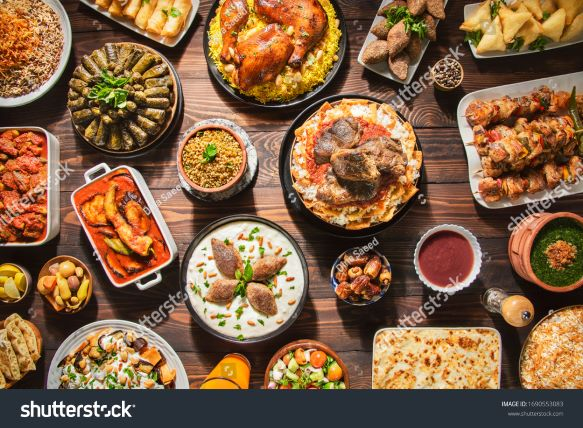

# Portfolio

I have done a few projects from scratch implementing data science and machine learning methodologies.

## [Beat Box](https://vatshivam.github.io/Novel_Song_Recommender/)

#### Song Recommendation system leveraging Content Based Filtering and NLP

## [Its Ronaldo!](https://vatshivam.github.io/Its-Ronaldo-/)

#### Gaining insights on game behavior of Cristiano Ronaldo.

## [Sahayata](https://vatshivam.github.io/sahayata-Analysis/)

#### Analyze crop prices and related features in North Indian wholesale markets.

## [Bon Appetit](https://vatshivam.github.io/Bon-Appetit/)

#### Case study on resturants across the globe to study their cuisines, ratings etc. according to their demographics.

## [US Airlines Sentiment Analysis](https://github.com/vatshivam/US-Airlines-Sentiment-Analysis)

#### Sentiment classification on US airlines twitter sentiments dataset using NLP.

